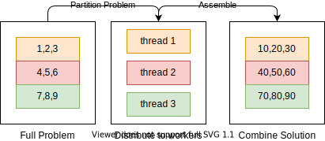
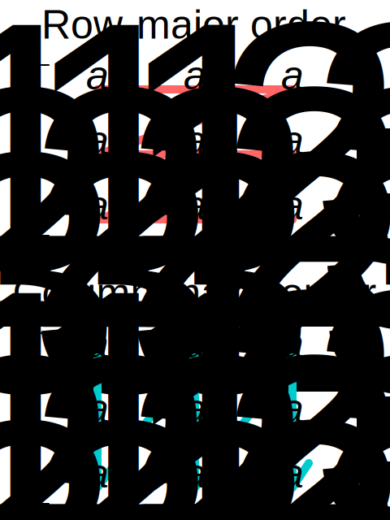

# 270191U025-Software-Architecture-assignment-7

During this exercise we take a look at how concurrency can be used to parallelize parts of an algorithm.
Specifically we examine how algorithms operating on matrices of data can be distributed across to multiple threads.

# Exercise

1. Examine the test case defined in `test_matrix.cpp` and compare it with the definition found in `matrix.hpp`
2. Implement the `multiply_single_threaded` method, this should multiply all entries in the matrix by a the specified constant. Re-run the test to verify that the first test case is passing.
3. Implement the `multiply_partitioned` methods, this should split the matrix into **n** parts and use spawn a separate thread to perform the multiplication of each part. Rerun the test to verify that all test cases pass.
   - Hint: Determine whether or not you need to use a mutex to ensure mutual exclusion? why or why not?
